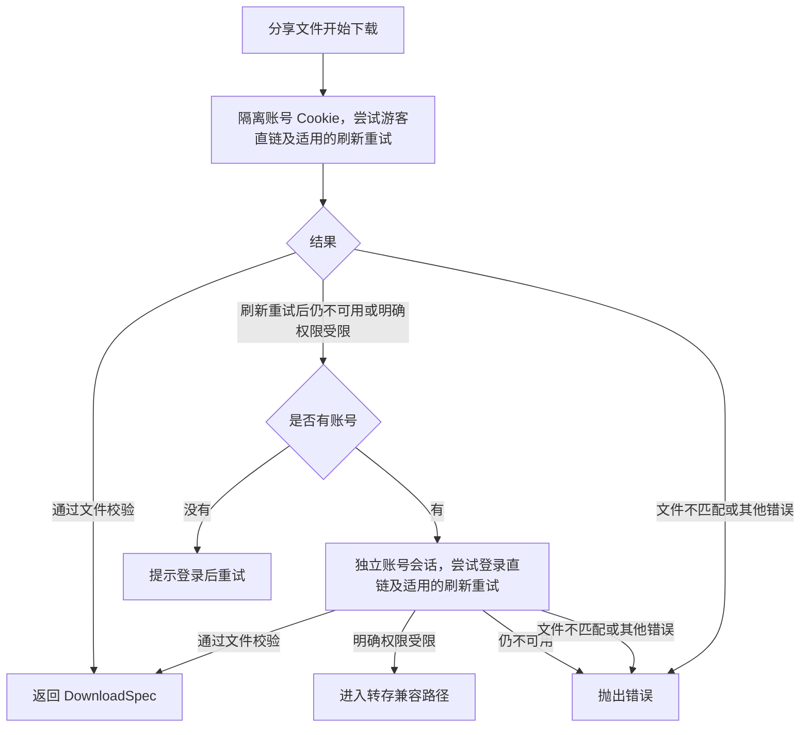

# 夸克分享文件：登录免转存下载的原理与实现

本文依据文析助手当前本地源码整理，核对日期：2026-10-04。

适用范围：**从夸克分享链接中选择文件，登录账号后直接获取该分享原文件的下载地址**。个人网盘文件下载、视频播放取流和分享转存是另外的路径，不应混为一谈。

文中的凭据、文件 ID 和下载地址均为占位示例，不包含实际账号信息。接口行为来自当前实现和已有测试，不代表夸克对第三方客户端提供的长期协议保证。

## 1. 核心原理

登录免转存下载的关键是：**在请求下载地址时，同时提交登录身份和分享文件访问凭证，让服务端直接为分享中的原文件返回下载地址。**

当前请求使用 `file/download` 接口，携带这些数据：

| 数据 | 含义 | 来源 |
| --- | --- | --- |
| 登录 Cookie | 当前访问者的账号会话 | 网页登录后保存的凭据 |
| `pwd_id` | 分享 ID | 原分享链接中的 `/s/<分享ID>` |
| `stoken` | 分享访问凭证 | 分享 token 接口 |
| `fids` | 要下载的原文件 ID 数组 | 分享文件列表中的 `fid` |
| `fids_token` | 每个原文件的分享访问凭证 | 列表中的 `share_fid_token` |

这些数据分别说明“谁在访问”“访问哪个分享”“访问分享中的哪个文件”。仅有登录 Cookie 或仅有 `fid`，都不能代替完整的分享上下文。

成功时，服务端返回该原文件的 `download_url`。客户端校验文件身份和长度后，交给下载器读取字节；不需要先在个人网盘创建副本。

这不意味着客户端自行生成下载签名、破解密码或解除会员限制。是否允许直链、速度多少、链接何时失效，仍由服务端决定。修改 UA 也不等于获得会员权限。

## 2. 与转存下载的区别

| 项目 | 登录免转存直链 | 转存后下载 |
| --- | --- | --- |
| 下载时使用的文件 ID | 分享中的原 `fid` | 转存返回的新 `fid` |
| 需要分享凭证 | 是 | 转存阶段需要 |
| 创建个人临时目录 | 否 | 当前实现会创建 |
| 调用 `share/sharepage/save` | 否 | 是 |
| 轮询转存任务 | 否 | 是 |
| 下载完成后的云端清理 | 该分支无临时文件可清理 | 通过清理任务处理临时目录 |
| 个人网盘目录发生变化 | 本地代码不发起文件写操作 | 会出现转存目录及文件 |

“免转存”描述的是成功直链分支，不是对整个下载入口的绝对承诺。当前 `download()` 保留了明确权限受限后的转存兼容路径。

## 3. 当前软件的完整决策流程

即使已有账号，软件仍然**先尝试游客直链**，只有需要时才使用登录凭据。



图中的刷新重试沿用发生失败时的身份：游客失败就重试游客，账号失败就重试账号。游客与账号共享一次分享刷新额度；游客已刷新过，账号就不能再刷新一次。账号重试如果仍不可用，会报错；如果返回明确权限限制，才允许转存。刷新分享本身失败、原文件消失或大小变化时，也会直接报错。

对应入口位于 `CookieCloudConnector.download()` 和 `tryShareDownload()`：

```dart
final direct = await tryShareDownload(
  session,
  file,
  credential,
  onRefreshed: (freshSession, freshFile) {
    session = freshSession;
    file = freshFile;
  },
);
return direct ?? await downloadFallback(session, file, credential);
```

这里 `null` 表示“直链遇到允许进入后续兼容路径的限制”；抛出异常不会被这段代码当成转存许可。

## 4. 第一步：获取登录身份

夸克网页登录入口是 `https://pan.quark.cn/?fr=pc&platform=pc`。登录信息由现有网页登录组件读取，经过账号验证后保存到本机凭据仓库。

当前登录 Cookie 的基本格式检查要求同时包含非空的：

```text
__pus=<账号会话值>; __puus=<会话值>
```

实际 Cookie 可以包含其他字段。仅格式正确不等于会话有效，服务端仍会验证其有效性。

### 会话刷新

账号直链请求前调用 `_sessions.ensureFresh()`。当前实现使用本地的 `quarkSessionRefreshedAt` 时间戳：距离最近刷新不足 90 分钟时通常跳过主动刷新；需要刷新时请求：

```http
GET https://drive-pc.quark.cn/1/clouddrive/config?pr=ucpro&fr=pc
Cookie: __pus=<值>; <其他保留字段>
```

刷新请求会临时移除旧的 `__puus`，尝试从响应 `Set-Cookie` 接收新值。90 分钟是客户端刷新策略，**不是对服务端 Cookie 有效期的判断**。

一次会话上下文只主动执行一次这类刷新尝试。刷新网络暂时失败时，现有 Cookie 仍可能继续尝试使用；不能据此断言账号已经失效。

## 5. 第二步：打开分享，获取 `stoken`

例如分享链接：

```text
https://pan.quark.cn/s/SHARE_ID
提取码：ABCD
```

请求示意：

```http
POST https://drive-pc.quark.cn/1/clouddrive/share/sharepage/token?pr=ucpro&fr=pc
Content-Type: application/json
Origin: https://pan.quark.cn
Referer: https://pan.quark.cn/
Cookie: <本次分享读取所用的 Cookie，可为空>

{
  "pwd_id": "SHARE_ID",
  "passcode": "ABCD",
  "support_visit_limit_private_share": true
}
```

程序从成功响应中读取 `data.stoken`，并构建 `BrowseSession`：

```text
session.sourceLink            原始 ParsedLink，包含分享链接和提取码
session.metadata.shareId      SHARE_ID
session.metadata.stoken       服务端返回的分享凭证
session.rootId                分享根目录标识
```

原分享链接必须保留。后续凭证失效时，程序依靠它重新打开分享，不能仅靠已经过期的下载 URL 恢复任务。

## 6. 第三步：读取文件列表，取得文件级 token

请求：

```http
GET https://drive-pc.quark.cn/1/clouddrive/share/sharepage/detail
```

查询参数主要包括：

```text
pr=ucpro
fr=pc
pwd_id=SHARE_ID
stoken=<分享凭证，必须按查询参数编码>
pdir_fid=<当前分享目录>
ver=2
_page=1
_size=100
_fetch_total=1
_sort=file_type:asc,file_name:asc
```

当前包装层还补充 `force=0`、`_fetch_banner=0`、`_fetch_share=0`、`fetch_relate_conversation=0`。

列表映射关系：

| 接口字段 | 本地字段 |
| --- | --- |
| `fid` | `CloudFile.id` |
| `file_name` / `fname` | `CloudFile.name` |
| `size` / `fsize` | `CloudFile.size` |
| `share_fid_token` | `CloudFile.token` |
| 正在读取的分享目录 | `CloudFile.parentId` |

特别注意两点：

1. `fids_token` 使用的是 `share_fid_token`，不能混用个人文件的 `fid_token`。
2. 分享目录与文件所有者的物理目录可能不同。根目录文件要记住当前分享目录，不能直接套用文件所有者的父目录 ID，否则刷新时可能出现“文件没有被分享”。

## 7. 第四步：带登录身份请求原文件直链

游客分支受限后，程序用传入的账号凭据创建新的隔离会话，必要时刷新 Cookie，然后执行与游客分支相同的分享下载请求。

完整请求示意：

```http
POST https://drive-pc.quark.cn/1/clouddrive/file/download?pr=ucpro&fr=pc&sys=win32&ve=6.9.7.761
Content-Type: application/json
Origin: https://pan.quark.cn
Referer: https://pan.quark.cn/
Cookie: __pus=<账号会话值>; __puus=<当前有效值>
User-Agent: Mozilla/5.0 (Windows NT 10.0; Win64; x64) AppleWebKit/537.36 (KHTML, like Gecko) Chrome/130.0.0.0 Safari/537.36 QuarkPC/6.9.7.761 QuarkCloudDrivePC/6.9.7.761 quark-cloud-drive/2.5.40

{
  "fids": ["ORIGINAL_FILE_ID"],
  "fids_token": ["SHARE_FILE_TOKEN"],
  "pwd_id": "SHARE_ID",
  "stoken": "SHARE_TOKEN",
  "speedup_session": "",
  "token": ""
}
```

其中 `speedup_session` 和 `token` 是当前实现保留的空兼容字段，不是登录 Cookie，也不是额外的会员密钥。

这个分支直接调用底层 transport，并显式指定分享下载专用 UA，避免通用 API 包装层把 UA 覆盖为另一套值。`headers('')` 也不意味着账号请求不带 Cookie：`CookieCloudConnector.headers()` 优先读取当前隔离会话的 Cookie。

可能的成功响应结构如下，示例地址不是真实可下载地址：

```json
{
  "status": 200,
  "code": 0,
  "data": [
    {
      "fid": "ORIGINAL_FILE_ID",
      "size": 965125094,
      "download_url": "https://download.example.quark.cn/example?signature=PLACEHOLDER"
    }
  ]
}
```

此时返回的 `fid` 仍应等于分享中的原文件 ID。该分支没有执行转存，因此不应该突然得到一个转存后的新 ID。

## 8. 第五步：更新 Cookie 并校验下载内容

### 8.1 接收服务端的 Cookie 更新

拿到下载接口响应后，先调用 `_sessions._accept()`。当前实现只接收 `Set-Cookie` 中的 `__pus`、`__puus`、`__pugs` 更新。

- 游客请求从空 Cookie 开始。返回的游客 Cookie 留在本次请求上下文，不覆盖本机已登录账号。
- 账号请求使用自己的账号上下文。保存更新时检查请求所属账号，避免并发返回的旧响应覆盖新会话。
- Cookie 正常轮换保留账号 `updatedAt`，避免普通续期被误认为用户切换了账号。
- 探测请求和实际下载使用处理响应之后的 Cookie，而不是请求发出前的一份旧副本。

`__pugs` 与账号 Cookie 可能影响下载地址的可用性，因此不能只复制 URL 而丢弃请求头，也不能将不同任务响应的 Cookie 混在一起。

### 8.2 校验 API 返回的文件身份

客户端要求：

1. `data` 是非空列表。
2. 列表恰好包含一个文件。
3. 返回的 `fid` 与所选原文件一致。
4. URL 使用 HTTP 或 HTTPS，不带 URL 用户名密码，主机名以 `.quark.cn` 结尾。
5. 已知原文件大小时，响应的 `size` 必须一致。

域名校验防止账号 Cookie 被直接发送到接口返回的任意第三方地址。取链阶段的一字节探测还禁止跟随重定向。

### 8.3 用一字节 Range 请求检查真实长度

随后请求：

```http
GET <download_url>
Range: bytes=0-0
Accept-Encoding: identity
User-Agent: <同一分享下载 UA>
Cookie: <更新后的当前会话 Cookie>
Referer: https://pan.quark.cn/
```

典型响应：

```http
HTTP/1.1 206 Partial Content
Content-Range: bytes 0-0/965125094
Content-Length: 1
```

检查要求：

- 206 响应的范围必须精确为 `bytes 0-0/<总大小>`；若有 `Content-Length`，必须为 1。
- 若服务端返回 200，则使用其 `Content-Length` 判断总大小。这可以通过长度检查，但不等于服务器支持多线程 Range。
- 总大小必须大于零，且与已知文件大小、接口返回大小一致。
- 不接受 gzip 等改变传输表示的编码；只接受无编码或 `identity`。

这能拦住大量错误页、替代文件和长度不一致的响应，但**不是整文件哈希校验**。等长替代内容不能单靠这个探测排除。

夸克列表当前不把服务端的 MD5 自动当作可靠整文件摘要。`DownloadSpec` 只传递 `CloudFile` 已有的独立校验信息；没有可信摘要时，不应宣称已经验证原文件哈希。

## 9. 第六步：交给下载器

通过校验后，返回：

```dart
DownloadSpec(
  url: address,
  fileName: file.name,
  expectedSize: total,
  headers: downloadHeaders,
  checksumType: file.hashType,
  checksumValue: file.hashValue,
)
```

此分支没有设置 `cleanup`，因为没有创建云端临时文件。仓库层再附加 `DownloadOrigin`，保存分享会话、原文件和账号修订信息，用于之后重新取链。

下载器负责字节传输、分段、暂停续传和本地落盘。免转存解决的是**如何获得原文件地址**，多线程解决的是**如何传输这些字节**，两者是不同层面的能力。免转存成功不保证达到预设连接数，也不保证提高服务端限速。

当临时地址失效需要刷新时，`CloudRepository.refresh()` 恢复原分享和对应文件，再调用 `prepare()` 获取新地址，而不是永久复用旧 URL。账号归属、账号修订和文件匹配校验仍然生效。

## 10. 失败分类与保底边界

以下为当前分享直链分支的处理规则：

| 情况 | 当前处理 |
| --- | --- |
| `stoken` 或文件 token 缺失 | 尝试重新打开分享并刷新同一文件 |
| 下载接口 HTTP 404 / 405 | 归为直链接口不可用，触发一次分享刷新重试 |
| 下载接口响应不是合法 JSON | 同上 |
| 下载接口业务码 `14001` / `41020` | 按分享凭证失效处理，触发一次刷新重试 |
| 成功响应没有非空直链列表 | 按接口不可用处理 |
| 下载接口 HTTP 401 / 403 | 当前直链身份受限，返回 `null` |
| 下载接口业务码 `23018` / `31001` | 当前直链身份受限，返回 `null` |
| 下载地址探测 HTTP 401 / 403 / 412 | 当前直链访问受限，返回 `null` |
| 文件 ID 不一致、大小不一致、URL 不合格、Range 格式异常 | 直接报错，不以此为由转存 |
| 原分享打不开、文件消失、刷新后大小变化 | 直接报错 |
| 网络异常或其他未分类业务错误 | 向上抛出，由外层适用的重试/提示逻辑处理 |

这些业务码是当前代码的分类依据，不应在缺少接口证据时把所有错误都解释成会员限制。

### 两种刷新不要混淆

| 刷新类型 | 刷新内容 | 当前边界 |
| --- | --- | --- |
| 账号会话刷新 | Cookie，主要是 `__puus` | 每个账号会话上下文有刷新标记 |
| 分享凭证刷新 | `stoken`、`share_fid_token`、对应原文件 | 每次 `tryShareDownload()` 最多一次，游客与账号共享该次数 |

分享刷新必须按原 `fid` 找到唯一的非目录文件，校验已知大小；双方有摘要时也比较摘要。它不会只按文件名选择同名文件。

一次 `tryShareDownload()` 中最多有三次直链业务尝试，例如：游客首次失败 → 游客刷新重试仍失败 → 账号直链尝试。若游客先返回明确权限限制，也可能是：游客一次 → 账号一次失败 → 账号刷新后重试一次。

这不是总 HTTP 请求次数上限：打开分享、列目录、账号刷新、下载地址探测和外层网络重试都可能产生额外请求。当前读取重试预算还会对部分网络错误及 408、425、429、500、502、503、504 做有限重试，不能把每次 HTTP 重发都视为一次新的分享凭证刷新。

### 什么时候仍然会转存

只有登录直链最终返回允许兼容的权限限制，`download()` 才继续调用 `downloadFallback()`。

当前转存路径大致为：查找或创建“文析助手临时转存”目录 → 创建本次任务子目录 → 调用 `share/sharepage/save` → 轮询转存任务 → 取得新文件 ID → 请求下载地址 → 登记并处理临时目录清理。

接口格式异常或凭证刷新后仍不可用，不会被当作自动转存许可。若业务要求严格禁止任何转存，调用层应使用 `tryShareDownload()` 并自行处理 `null`，不要调用包含转存回退的 `download()`；当前普通下载入口并不是这种严格模式。

## 11. 如何判断真的没有转存

建议结合三类证据，而不是只看“下载成功”：

1. **请求记录**：登录直链成功前后没有个人目录创建、`share/sharepage/save`、转存任务轮询和临时删除请求。
2. **文件身份**：取链请求和响应使用同一个分享原 `fid`，没有切换成转存新 ID。
3. **本地结果**：得到可读取的原文件地址，`cleanup == null`；分段长度、完整大小和可用摘要符合预期。

`cleanup == null` 单独不是充分证据，应与请求记录和文件身份一起判断。服务端可能记录访问历史，这不属于客户端转存操作。

## 12. 已有验证与适用限制

2026-10-03 的本地实测中，一个 **965,125,094 字节**的夸克分享文件：

- 游客直链受限。
- 使用备份账号后成功取得直链。
- 测试传输层禁止创建、转存、复制、删除、上传等写请求，成功路径未触发这些操作。
- 文件头部、中部、尾部各读取 64 KiB，均返回符合预期的 HTTP 206 和范围。

这个实测说明该分享在当时环境下支持登录免转存取链和分段读取，**没有据此证明所有分享可用，也没有在该次探测中完整下载整个文件**。

本项目没有用固定的“超过 50 MB 必须登录/转存”规则决定路由，而是依据实际接口结果。服务端可能因账号状态、分享类型、风控、文件状态或策略变化而改变结果。

已有自动化测试覆盖：游客 Cookie 隔离、并发 Cookie 不串用、登录直链与 Cookie 更新、凭证刷新次数、按原 ID 重新查找文件、非法地址和错误长度拒绝、网络错误不触发转存、刷新后的上下文交给兼容路径等。

## 13. 源码与测试索引

| 文件 | 关注位置 |
| --- | --- |
| [cookie_cloud.dart](../lib/data/providers/cookie_cloud.dart) | `download`、`tryShareDownload`、`_shareDownload`、`_CookieCloudHttp`：决策、取链、隔离、刷新、校验 |
| [quark_uc.dart](../lib/data/providers/quark_uc.dart) | `openShare`、`list`、`prepareFile`：分享凭证、文件映射、转存兼容 |
| [quark.dart](../lib/data/providers/quark.dart) | 夸克连接器与播放取流分支 |
| [cloud_repository.dart](../lib/data/cloud_repository.dart) | `prepare`、`_prepareBound`、`refresh`、`restoreOrigin`：任务来源与账号归属 |
| [auth.dart](../lib/domain/auth.dart) | 登录 Cookie 格式、网页登录入口与凭据处理 |
| [http.dart](../lib/data/http.dart) | `peek`：有限读取与一字节 Range 探测 |
| [http_retry.dart](../lib/data/http_retry.dart) | 读取操作的有限重试预算 |
| [cookie_share_direct_test.dart](../test/cookie_share_direct_test.dart) | 分享直链与刷新、身份隔离、错误分类测试 |
| [quark_share_download_test.dart](../test/quark_share_download_test.dart) | 夸克分享取链与兼容路径测试 |
| [parse_page_test.dart](../test/parse_page_test.dart) | 游客解析与下载入口测试 |

接口或客户端版本调整时，应同步核对 UA、请求参数、错误码分类、Cookie 更新行为和文件校验；不要只修改某个版本字符串就认为已经完成协议适配。
